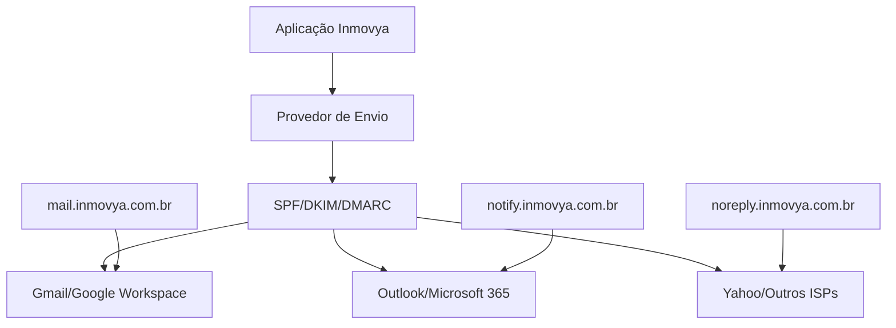

# Sistema de Entregabilidade & Compliance (SEC) - Inmovya

**Versão:** 1.0  
**Data:** Janeiro 2025  
**Empresa:** Inmovya  
**Domínio Principal:** inmovya.com.br

---

## 1. Arquitetura Técnica

### 1.1 Diagrama de Envio



### 1.2 Estratégia de Domínios

| Tipo de Envio | Subdomínio | Finalidade | Volume Diário |
|---------------|------------|------------|---------------|
| Transacional | mail.inmovya.com.br | Confirmações, senhas, notificações | 500-1000 |
| Marketing | notify.inmovya.com.br | Campanhas, newsletters | 1000-5000 |
| Sistema | noreply.inmovya.com.br | Alertas automáticos | 100-500 |

### 1.3 Limites de Envio por Provedor

| Provedor | Tipo de Conta | Limite Diário | Limite por Hora | Observações |
|----------|---------------|---------------|-----------------|-------------|
| Gmail Pessoal | Gratuito | 500 | 100 | Recomendado: 400/dia |
| Google Workspace | Pago | 2000 | 300 | Pode variar por reputação |
| Outlook 365 | Business | 10000 | 500 | Com IP dedicado |
| Brevo/Sendinblue | SaaS | Conforme plano | Conforme plano | Pay-as-you-go |

---

## 2. Autenticação & DNS

### 2.1 Registros SPF

**Para domínio principal (inmovya.com.br):**
```dns
inmovya.com.br. 3600 IN TXT "v=spf1 include:_spf.google.com include:spf.brevo.com ip4:IP_SERVIDOR -all"
```

**Para subdomínios:**
```dns
mail.inmovya.com.br. 3600 IN TXT "v=spf1 include:_spf.google.com -all"
notify.inmovya.com.br. 3600 IN TXT "v=spf1 include:spf.brevo.com -all"
noreply.inmovya.com.br. 3600 IN TXT "v=spf1 include:_spf.google.com -all"
```

### 2.2 Registros DKIM

**Chave de 2048 bits (recomendado):**
```dns
s1._domainkey.inmovya.com.br. 3600 IN TXT "v=DKIM1; k=rsa; p=CHAVE_PUBLICA_AQUI"
s2._domainkey.mail.inmovya.com.br. 3600 IN TXT "v=DKIM1; k=rsa; p=CHAVE_PUBLICA_AQUI"
s3._domainkey.notify.inmovya.com.br. 3600 IN TXT "v=DKIM1; k=rsa; p=CHAVE_PUBLICA_AQUI"
```

**Instruções para gerar chaves:**
1. Acesse seu provedor de envio (Google Workspace, Brevo, etc.)
2. Gere chave DKIM de 2048 bits
3. Configure seletor único (s1, s2, s3)
4. Adicione registro TXT no DNS
5. Verifique com: `dig TXT s1._domainkey.inmovya.com.br`

### 2.3 Registros DMARC

**Fase 1 - Monitoramento (p=none):**
```dns
_dmarc.inmovya.com.br. 3600 IN TXT "v=DMARC1; p=none; rua=mailto:dmarc-reports@inmovya.com.br; ruf=mailto:dmarc-forensic@inmovya.com.br; pct=100; sp=none; adkim=r; aspf=r"
```

**Fase 2 - Quarentena (após 30 dias):**
```dns
_dmarc.inmovya.com.br. 3600 IN TXT "v=DMARC1; p=quarantine; rua=mailto:dmarc-reports@inmovya.com.br; ruf=mailto:dmarc-forensic@inmovya.com.br; pct=50; sp=quarantine; adkim=s; aspf=s"
```

**Fase 3 - Rejeição (após 60 dias):**
```dns
_dmarc.inmovya.com.br. 3600 IN TXT "v=DMARC1; p=reject; rua=mailto:dmarc-reports@inmovya.com.br; ruf=mailto:dmarc-forensic@inmovya.com.br; pct=100; sp=reject; adkim=s; aspf=s"
```

### 2.4 Registro BIMI (Opcional)

```dns
default._bimi.inmovya.com.br. 3600 IN TXT "v=BIMI1; l=https://inmovya.com.br/logo-bimi.svg; a=https://inmovya.com.br/vmc-certificate.pem"
```

**Requisitos para BIMI:**
- DMARC em quarantine ou reject
- Logo em formato SVG Tiny Portable/Secure
- Certificado VMC (opcional, mas recomendado)
- Dimensões: 1:1 (quadrado)

---

## 3. Aquecimento (Warm-Up) & Reputação

### 3.1 Plano de 30 Dias

| Semana | Volume/Dia | ISPs Alvo | Meta Abertura | Meta Clique | Ações |
|--------|------------|-----------|---------------|-------------|-------|
| 1-7    | 50-100     | Gmail     | >25%         | >3%         | Base super engajada |
| 8-14   | 100-300    | Gmail + Outlook | >20%   | >2.5%       | Adicionar segmento ativo |
| 15-21  | 300-800    | Todos ISPs | >18%        | >2%         | Expandir para prospects |
| 22-30  | 800-2000   | Todos ISPs | >15%        | >1.5%       | Volume total planejado |

### 3.2 Sequência de Aquecimento

**Dias 1-7: Base Super Engajada**
- Lista: clientes ativos últimos 30 dias
- Conteúdo: transacional + valor alto
- Horário: 10h-14h (horário comercial)
- Frequência: 1x por dia útil

**Dias 8-14: Segmento Ativo**
- Adicionar: prospects engajados últimos 60 dias
- Conteúdo: mix transacional/informativo
- Horário: expandir para 9h-17h
- Frequência: até 2x por semana

**Dias 15-21: Expansão Controlada**
- Adicionar: leads qualificados últimos 90 dias
- Conteúdo: newsletter + ofertas soft
- Monitorar: bounce rate < 2%
- Parar se: complaint rate > 0.1%

**Dias 22-30: Volume Operacional**
- Lista completa (com consent)
- Conteúdo: campanha completa
- Monitoramento intensivo
- Ajustes baseados em métricas

### 3.3 Regras de Ouro

1. **Parar imediatamente se:**
   - Bounce rate > 3%
   - Complaint rate > 0.1%
   - Delivery rate < 95%
   - Queda >50% na taxa de abertura

2. **Reduzir volume se:**
   - Aumento de deferrals (421, 450)
   - Queda gradual de engagement
   - Alertas do Google Postmaster Tools

---

## 4. Higiene de Lista & Consentimento

### 4.1 Processo de Duplo Opt-in

**Fluxo:**
1. Usuário preenche formulário
2. Email automático de confirmação
3. Clique no link confirma inscrição
4. Welcome email + preferências
5. Registro de timestamp e IP

**Template de Confirmação:**
```html
Assunto: Confirme sua inscrição - Inmovya

Olá [NOME],

Para completar sua inscrição em nossa newsletter, clique no link abaixo:

[CONFIRMAR INSCRIÇÃO] - https://inmovya.com.br/confirm?token=XXX

Se você não se inscreveu, ignore este email.

Atenciosamente,
Equipe Inmovya
```

### 4.2 Sunset Policy

**Critérios de Inatividade:**
- 90 dias sem abertura = "Dormindo"
- 180 dias sem abertura = "Inativo"
- 365 dias sem abertura = "Supressão"

**Campanha de Reengajamento (após 90 dias):**
```
Assunto: Sentimos sua falta! Quer continuar recebendo nossos emails?

Conteúdo:
- Benefícios perdidos
- Opção de atualizar preferências
- Link "Continuar recebendo"
- Link "Descadastrar"
```

### 4.3 Suppression Lists

**Bounces Duros (Remoção Imediata):**
- 550 5.1.1 (usuário não existe)
- 550 5.1.10 (endereço rejeitado)
- 550 5.7.1 (endereço bloqueado)

**Complaints (Suppression Permanente):**
- Marcação como spam
- Abuse reports de ISPs
- Pedidos diretos de remoção

**Role Accounts (Avaliar Caso a Caso):**
- Remover: admin@, noreply@, postmaster@
- Manter se B2B relevante: marketing@, vendas@, contato@

### 4.4 Validação Pré-envio

**Verificações Automáticas:**
1. Formato de email válido (regex)
2. Domínio existente (MX record)
3. Não está em suppression list
4. Consent timestamp válido
5. Não é role account inadequado

---

## 5. Conteúdo & Template

### 5.1 Checklist Anti-Spam

**Assunto:**
- [ ] Máximo 50 caracteres
- [ ] Sem palavras gatilho (GRÁTIS, URGENTE, $$$)
- [ ] Sem excess caps (>30% maiúsculas)
- [ ] Personalização relevante
- [ ] Sem caracteres especiais excessivos

**Corpo do Email:**
- [ ] Proporção texto/imagem > 70/30
- [ ] Alt text em todas as imagens
- [ ] Links não encurtados ou com domínio próprio
- [ ] Sem JavaScript ou Flash
- [ ] Codificação UTF-8
- [ ] Sem attachments executáveis

**Links:**
- [ ] Domínio próprio para tracking
- [ ] HTTPS obrigatório
- [ ] Máximo 3-5 links por email
- [ ] Link de descadastro visível e funcional
- [ ] Não usar IP direto nos links

**Rodapé Legal:**
- [ ] Razão social e CNPJ
- [ ] Endereço físico completo
- [ ] Link de descadastro em 1 clique
- [ ] Política de privacidade
- [ ] Motivo do recebimento

### 5.2 Política Editorial

**Relevância:**
- Segmentação por interesse demonstrado
- Personalização baseada em comportamento
- Conteúdo adequado ao estágio do funil

**Frequência Máxima:**
- Clientes ativos: 2x por semana
- Prospects: 1x por semana
- Leads frios: 2x por mês
- Transacional: sem limite (quando relevante)

**Linha Editorial:**
- 60% conteúdo educativo/informativo
- 30% ofertas soft/cases de sucesso
- 10% ofertas diretas/promocionais

### 5.3 Templates HTML

**Template Transacional:**
```html
<!DOCTYPE html>
<html lang="pt-BR">
<head>
    <meta charset="UTF-8">
    <meta name="viewport" content="width=device-width, initial-scale=1.0">
    <title>{{ASSUNTO}}</title>
</head>
<body style="font-family: Arial, sans-serif; line-height: 1.6; margin: 0; padding: 20px;">
    <table width="100%" max-width="600" style="margin: 0 auto;">
        <tr>
            <td style="text-align: center; padding: 20px 0;">
                
            </td>
        </tr>
        <tr>
            <td style="padding: 20px; background: #f9f9f9;">
                <h2>{{TITULO}}</h2>
                {{CONTEUDO}}
            </td>
        </tr>
        <tr>
            <td style="padding: 20px; font-size: 12px; color: #666; text-align: center;">
                <p><strong>Inmovya Consultoria Imobiliária</strong><br>
                CNPJ: XX.XXX.XXX/0001-XX<br>
                Endereço: Rua das Flores, 123 - São Paulo/SP - CEP 01234-567<br>
                Telefone: (11) 1234-5678</p>
                
                <p>Você recebeu este email porque solicitou este tipo de comunicação.<br>
                Se não deseja mais receber, <a href="{{LINK_DESCADASTRO}}">clique aqui</a>.</p>
                
                <p><a href="https://inmovya.com.br/privacidade">Política de Privacidade</a></p>
            </td>
        </tr>
    </table>
</body>
</html>
```

**Template Marketing:**
```html
<!DOCTYPE html>
<html lang="pt-BR">
<head>
    <meta charset="UTF-8">
    <meta name="viewport" content="width=device-width, initial-scale=1.0">
    <title>{{ASSUNTO}}</title>
</head>
<body style="font-family: 'Segoe UI', Tahoma, Geneva, Verdana, sans-serif; margin: 0; padding: 0; background-color: #f4f4f4;">
    <table width="100%" bgcolor="#f4f4f4">
        <tr>
            <td align="center" style="padding: 20px 0;">
                <table width="600" bgcolor="#ffffff" style="border-radius: 8px; box-shadow: 0 2px 10px rgba(0,0,0,0.1);">
                    <!-- Header -->
                    <tr>
                        <td style="padding: 30px; text-align: center; background: linear-gradient(135deg, #667eea 0%, #764ba2 100%);">
                            
                        </td>
                    </tr>
                    
                    <!-- Content -->
                    <tr>
                        <td style="padding: 40px 30px;">
                            <h1 style="color: #333; margin: 0 0 20px 0;">Olá, {{NOME}}!</h1>
                            {{CONTEUDO_PRINCIPAL}}
                            
                            <div style="text-align: center; margin: 30px 0;">
                                <a href="{{LINK_CTA}}" style="background: linear-gradient(135deg, #667eea 0%, #764ba2 100%); color: white; padding: 15px 30px; text-decoration: none; border-radius: 5px; font-weight: bold; display: inline-block;">
                                    {{TEXTO_CTA}}
                                </a>
                            </div>
                        </td>
                    </tr>
                    
                    <!-- Footer -->
                    <tr>
                        <td style="padding: 20px 30px; background: #f8f9fa; border-radius: 0 0 8px 8px;">
                            <table width="100%">
                                <tr>
                                    <td style="font-size: 12px; color: #666;">
                                        <p><strong>Inmovya Consultoria Imobiliária Ltda.</strong><br>
                                        CNPJ: XX.XXX.XXX/0001-XX<br>
                                        Rua das Flores, 123 - Bairro - São Paulo/SP - CEP 01234-567<br>
                                        Tel: (11) 1234-5678 | WhatsApp: (11) 99999-9999</p>
                                        
                                        <p>Você está recebendo porque se inscreveu em nossa newsletter.<br>
                                        <a href="{{LINK_PREFERENCIAS}}">Gerenciar preferências</a> | 
                                        <a href="{{LINK_DESCADASTRO}}">Descadastrar</a></p>
                                        
                                        <p><a href="https://inmovya.com.br/privacidade">Política de Privacidade</a> | 
                                        <a href="https://inmovya.com.br/termos">Termos de Uso</a></p>
                                    </td>
                                </tr>
                            </table>
                        </td>
                    </tr>
                </table>
            </td>
        </tr>
    </table>
</body>
</html>
```

---

## 6. Monitoramento & Alertas

### 6.1 Integrações Obrigatórias

**Google Postmaster Tools:**
1. Acesse: https://postmaster.google.com
2. Adicione domínio: inmovya.com.br
3. Verifique via DNS TXT
4. Configure alertas para:
   - IP/Domain reputation baixa
   - Spam rate alto
   - Delivery errors

**Microsoft SNDS:**
1. Acesse: https://sendersupport.olc.protection.outlook.com/snds/
2. Registre IPs de envio
3. Configure monitoramento
4. Solicite whitelist se necessário

### 6.2 Métricas-Chave (KPIs)

| Métrica | Meta | Alerta Amarelo | Alerta Vermelho |
|---------|------|----------------|-----------------|
| Delivery Rate | >98% | <95% | <90% |
| Bounce Rate (Hard) | <2% | 2-5% | >5% |
| Bounce Rate (Soft) | <5% | 5-10% | >10% |
| Complaint Rate | <0.1% | 0.1-0.3% | >0.3% |
| Open Rate | >15% | 10-15% | <10% |
| Click Rate | >2% | 1-2% | <1% |
| Inbox Placement | >90% | 70-90% | <70% |

### 6.3 Códigos de Erro Comuns

**Temporários (4xx) - Tentar Novamente:**
- 421: Serviço indisponível
- 450: Mailbox ocupada
- 451: Erro local no processamento
- 452: Cota de armazenamento excedida

**Permanentes (5xx) - Não Tentar Novamente:**
- 550 5.1.1: Usuário desconhecido
- 550 5.7.1: Mensagem rejeitada por política
- 552: Cota excedida
- 554: Transação falhou

### 6.4 Dashboard de Monitoramento

**Visão Diária:**
- Volume enviado vs. entregue
- Taxa de abertura por ISP
- Bounce rate por campanha
- Complaints recebidos
- Status de reputação (Postmaster Tools)

**Visão Semanal:**
- Tendência de engagement
- Performance por segmento
- Evolução de suppressions
- Relatórios DMARC
- Comparativo com semana anterior

**Alertas Automáticos:**
- SMS/WhatsApp para limites críticos
- Email para equipe de marketing
- Slack/Teams para equipe técnica
- Pausar campanha automaticamente

---

## 7. Governança & Segurança

### 7.1 Perfis e Permissões

**Administrador de Sistema:**
- Configurar DNS/SPF/DKIM/DMARC
- Gerenciar integrações
- Visualizar todos os relatórios
- Configurar alertas e limites

**Gerente de Marketing:**
- Criar e aprovar campanhas
- Visualizar relatórios de performance
- Gerenciar segmentação de listas
- Definir calendário editorial

**Analista de Email Marketing:**
- Executar campanhas aprovadas
- Monitorar métricas diárias
- Processar bounces e complaints
- Gerar relatórios semanais

**Analista Júnior:**
- Criação de conteúdo
- Preparação de listas
- Apenas leitura de relatórios
- Não pode enviar campanhas

### 7.2 Processo de Aprovação

**Campanhas de Marketing (>1000 destinatários):**
1. Criação pelo analista
2. Revisão de conteúdo (gerente)
3. Validação técnica (admin sistema)
4. Aprovação legal se necessário
5. Agendamento e envio

**Emails Transacionais:**
- Pré-aprovados por template
- Envio automático permitido
- Monitoramento contínuo
- Revisão mensal de performance

### 7.3 Rotinas de Segurança

**Mensal:**
- [ ] Rotacionar chaves DKIM
- [ ] Revisar registros DNS
- [ ] Validar certificados TLS
- [ ] Auditoria de acessos

**Trimestral:**
- [ ] SPF flattening se necessário
- [ ] Revisão de IPs em blacklists
- [ ] Atualização de suppressions
- [ ] Treinamento da equipe

**Anual:**
- [ ] Renovação de certificados
- [ ] Auditoria completa de compliance
- [ ] Revisão de políticas internas
- [ ] Validação LGPD

### 7.4 Práticas Proibidas

**Jamais fazer:**
- Usar domínios descartáveis
- Rotacionar IPs para "driblar" filtros
- Camuflar links (cloaking)
- Enviar sem consentimento
- Ignorar pedidos de descadastro
- Usar listas compradas/alugadas
- Snowshoeing (múltiplos IPs/domínios)
- Conteúdo camuflado (texto branco)

---

## 8. Operação Diária (SOPs)

### 8.1 SOP: Criação de Lista com Consent

**Passo a Passo:**
1. **Fonte de Dados:**
   - Verificar origem (site, evento, parceiro)
   - Confirmar existência de opt-in
   - Validar timestamp de consentimento

2. **Preparação:**
   - Remover duplicatas
   - Validar formato de emails
   - Verificar contra suppression list
   - Classificar por segmento

3. **Validação Técnica:**
   - Rodar validação de domínios
   - Remover role accounts inadequados
   - Verificar MX records
   - Marcar como "nova lista"

4. **Aquecimento:**
   - Começar com 10% mais engajados
   - Aumentar 25% a cada 3-7 dias
   - Monitorar métricas constantemente
   - Parar se alertas dispararem

### 8.2 SOP: Envio de Campanha

**Pré-envio:**
- [ ] Lista validada e aprovada
- [ ] Conteúdo aprovado pela gerência
- [ ] Teste A/B definido (se aplicável)
- [ ] Assunto testado em spam checkers
- [ ] Template testado em diferentes clientes
- [ ] Link de descadastro funcionando
- [ ] Programação de horário adequada

**Durante o Envio:**
- [ ] Monitorar primeiros 100 envios
- [ ] Verificar delivery rate inicial
- [ ] Acompanhar bounce rate
- [ ] Pausar se métricas anômalas

**Pós-envio:**
- [ ] Relatório de entrega (2h após)
- [ ] Análise de engajamento (24h após)
- [ ] Processamento de bounces/complaints
- [ ] Atualização de suppressions
- [ ] Documentação de aprendizados

### 8.3 SOP: Tratamento de Incidentes

**Bounce Rate Alto (>5%):**
1. Pausar campanha imediatamente
2. Analisar códigos de erro
3. Verificar saúde da lista
4. Remover hard bounces
5. Investigar mudanças recentes
6. Ajustar estratégia de envio

**Complaint Rate Alto (>0.3%):**
1. Parar todos os envios
2. Analisar conteúdo da campanha
3. Verificar segmentação
4. Revisar processo de opt-in
5. Processar todas as complaints
6. Implementar correções antes de retomar

**Queda na Taxa de Abertura (>50%):**
1. Verificar se emails estão chegando
2. Testar diferentes horários
3. Analisar assuntos utilizados
4. Verificar reputação no Postmaster Tools
5. Considerar re-engajamento da lista

### 8.4 SOP: Descadastro e Preferências

**Processamento de Opt-out:**
1. Processar solicitação em até 2 horas
2. Confirmar remoção por email
3. Atualizar todas as listas
4. Registrar motivo se fornecido
5. Não enviar marketing após opt-out
6. Manter apenas transacionais essenciais

**Central de Preferências:**
- Frequência de emails (diária, semanal, mensal)
- Tipos de conteúdo (novidades, ofertas, educativo)
- Formato preferido (HTML, texto)
- Horário preferido de recebimento

---

## 9. Roadmap de Evolução (90 dias)

### 9.1 Fase 1 (Dias 1-30): Fundação

**Semana 1-2:**
- [ ] Configurar DNS (SPF, DKIM, DMARC p=none)
- [ ] Implementar double opt-in
- [ ] Criar suppression lists
- [ ] Definir templates base
- [ ] Configurar Google Postmaster Tools

**Semana 3-4:**
- [ ] Iniciar programa de aquecimento
- [ ] Implementar tracking básico
- [ ] Criar processo de aprovação
- [ ] Treinar equipe nos SOPs
- [ ] Configurar alertas básicos

### 9.2 Fase 2 (Dias 31-60): Otimização

**Semana 5-6:**
- [ ] DMARC para p=quarantine
- [ ] Segmentação comportamental
- [ ] Testes A/B de assunto
- [ ] Dashboard de monitoramento
- [ ] Integração com Microsoft SNDS

**Semana 7-8:**
- [ ] Implementar BIMI
- [ ] Otimização de conteúdo
- [ ] Automação de reengajamento
- [ ] Relatórios semanais automatizados
- [ ] Auditoria de conformidade LGPD

### 9.3 Fase 3 (Dias 61-90): Excelência

**Semana 9-10:**
- [ ] DMARC para p=reject
- [ ] Domínios dedicados por produto
- [ ] Avaliação de IP dedicado
- [ ] Testes de inbox placement
- [ ] Certificação BIMI (VMC)

**Semana 11-12:**
- [ ] Machine learning para segmentação
- [ ] Otimização de send time
- [ ] Integração com CRM
- [ ] Programa de certificação de equipe
- [ ] Documentação completa finalizada

---

## 10. Regras de Conformidade e Ética

### 10.1 Conformidade LGPD

**Base Legal para Processamento:**
- Consentimento explícito e específico
- Execução de contrato (transacionais)
- Interesse legítimo (comunicações relevantes)
- Cumprimento de obrigação legal

**Direitos dos Titulares:**
- Acesso aos dados
- Correção de dados
- Eliminação de dados
- Portabilidade de dados
- Revogação de consentimento

**Registro de Atividades:**
- Data/hora do consentimento
- IP e user agent
- Versão da política de privacidade aceita
- Finalidade específica
- Histórico de alterações

### 10.2 Compliance CAN-SPAM

**Requisitos Obrigatórios:**
- Identificação clara do remetente
- Assunto não enganoso
- Identificação como publicidade (quando aplicável)
- Endereço físico válido
- Mecanismo de opt-out funcional
- Processamento de opt-out em até 10 dias

### 10.3 Auditoria e Logs

**Logs Obrigatórios:**
- Todas as campanhas enviadas
- Consentimentos coletados
- Opt-outs processados
- Alterações em configurações
- Acessos ao sistema

**Retenção:**
- Logs de campanha: 3 anos
- Consentimentos: enquanto ativo + 5 anos
- Opt-outs: permanente
- Auditorias: 7 anos

---

## 11. Personalização Inmovya

### 11.1 Configurações Específicas

**Domínio Principal:** inmovya.com.br  
**Provedores de Envio:**
- Google Workspace (transacional)
- Brevo/Sendinblue (marketing)
- Backup: Mailgun

**Volume Médio Diário:** 2.000-5.000 emails  
**Pico Semanal:** 15.000 emails (campanhas especiais)

**Segmentos de Público:**
- Clientes ativos (proprietários)
- Prospects qualificados (interessados)
- Leads de captação (site/eventos)
- Parceiros e corretores
- Investidores

**Tipos de Email:**
- Transacional: 40% (confirmações, alertas)
- Marketing: 50% (newsletters, ofertas)
- Notificações: 10% (sistema, lembretes)

### 11.2 Configuração DNS Inmovya

```dns
; Registros SPF
inmovya.com.br. 3600 IN TXT "v=spf1 include:_spf.google.com include:spf.brevo.com -all"
mail.inmovya.com.br. 3600 IN TXT "v=spf1 include:_spf.google.com -all"
notify.inmovya.com.br. 3600 IN TXT "v=spf1 include:spf.brevo.com -all"

; Registros DKIM (valores exemplo - substituir pelas chaves reais)
s1._domainkey.inmovya.com.br. 3600 IN TXT "v=DKIM1; k=rsa; p=MIIBIjANBgkqhkiG9w0BAQEFAAOCAQ8AMIIBCgKCAQEA..."
s2._domainkey.mail.inmovya.com.br. 3600 IN TXT "v=DKIM1; k=rsa; p=MIIBIjANBgkqhkiG9w0BAQEFAAOCAQ8AMIIBCgKCAQEA..."

; Registro DMARC
_dmarc.inmovya.com.br. 3600 IN TXT "v=DMARC1; p=none; rua=mailto:dmarc@inmovya.com.br; ruf=mailto:dmarc@inmovya.com.br; pct=100"

; Registro BIMI (futuro)
default._bimi.inmovya.com.br. 3600 IN TXT "v=BIMI1; l=https://inmovya.com.br/assets/logo-bimi.svg"
```

---

## 12. Checklist de Implementação

### 12.1 Checklist Pré-Launch

**Configuração Técnica:**
- [ ] DNS configurado (SPF, DKIM, DMARC)
- [ ] Provedores de envio configurados
- [ ] Domínios verificados
- [ ] Certificados SSL válidos
- [ ] Tracking domains configurados

**Processos:**
- [ ] Double opt-in implementado
- [ ] Suppression lists criadas
- [ ] SOPs documentados
- [ ] Equipe treinada
- [ ] Aprovações definidas

**Monitoramento:**
- [ ] Google Postmaster Tools configurado
- [ ] Microsoft SNDS registrado
- [ ] Alertas configurados
- [ ] Dashboard funcionando
- [ ] Relatórios automatizados

**Compliance:**
- [ ] Política de privacidade atualizada
- [ ] Termos de uso revisados
- [ ] Base legal documentada
- [ ] Processo de opt-out testado
- [ ] Logs configurados

### 12.2 Checklist Pré-envio (Campanha)

**Lista:**
- [ ] Fonte com consent verificado
- [ ] Duplicatas removidas
- [ ] Suppression aplicada
- [ ] Segmentação adequada
- [ ] Volume dentro do limite

**Conteúdo:**
- [ ] Assunto spam-free
- [ ] Remetente identificado
- [ ] Proporção texto/imagem OK
- [ ] Links funcionando
- [ ] Descadastro visível

**Técnico:**
- [ ] Template testado
- [ ] Preview em clientes diferentes
- [ ] Links rastreáveis
- [ ] SPF/DKIM alinhados
- [ ] Horário adequado

**Aprovações:**
- [ ] Conteúdo aprovado
- [ ] Lista aprovada
- [ ] Cronograma definido
- [ ] Responsável designado
- [ ] Backup plan definido

---

## 13. Templates de Webhooks

### 13.1 JSON de Eventos (Exemplo Brevo)

```json
{
  "event": "delivered",
  "email": "cliente@exemplo.com",
  "id": 12345,
  "date": "2025-01-15T10:30:00Z",
  "ts": 1642248600,
  "message-id": "<message-id@inmovya.com.br>",
  "tag": "campanha-janeiro-2025",
  "sending_ip": "185.107.232.1",
  "ts_event": 1642248600,
  "subject": "Novidades Inmovya - Janeiro 2025"
}
```

**Eventos a Monitorar:**
- `delivered`: Email entregue
- `bounced`: Email retornou (bounce)
- `spam`: Marcado como spam
- `opened`: Email aberto
- `clicked`: Link clicado
- `unsubscribed`: Descadastro solicitado
- `blocked`: Bloqueado pelo provedor

### 13.2 Processamento de Webhooks

```javascript
// Exemplo de processamento de webhook
function processWebhook(event) {
    switch(event.event) {
        case 'bounced':
            if (event.error.includes('5.1.1')) {
                // Hard bounce - remover da lista
                suppressEmail(event.email, 'hard_bounce');
            }
            break;
            
        case 'spam':
            // Complaint - remover imediatamente
            suppressEmail(event.email, 'complaint');
            alertTeam('High priority: Spam complaint received');
            break;
            
        case 'unsubscribed':
            // Opt-out - processar em até 2 horas
            processOptOut(event.email, event.tag);
            break;
            
        case 'opened':
            // Engagement positivo
            updateEngagement(event.email, 'opened', event.ts);
            break;
    }
}
```

---

## 14. Política Interna de Envio

### 14.1 Princípios Fundamentais

**1. Consentimento é Sagrado**
- Todo email deve ter consentimento explícito
- Opt-in deve ser específico para o tipo de comunicação
- Opt-out deve ser processado imediatamente
- Jamais usar listas compradas ou alugadas

**2. Qualidade sobre Quantidade**
- Preferir listas menores e engajadas
- Segmentar baseado em interesse real
- Remover inativos regularmente
- Focar em valor para o destinatário

**3. Transparência Total**
- Identificar claramente o remetente
- Explicar o motivo do recebimento
- Fornecer contato para dúvidas
- Manter política de privacidade atualizada

**4. Compliance Rigoroso**
- Seguir LGPD, CAN-SPAM e boas práticas
- Documentar todos os processos
- Manter logs auditáveis
- Treinar equipe regularmente

### 14.2 Responsabilidades por Função

**CEO/Diretor:**
- Aprovar política geral de email marketing
- Definir orçamento e recursos
- Responsabilidade final por compliance
- Decisões estratégicas sobre reputação

**Gerente de Marketing:**
- Implementar política operacional
- Aprovar campanhas de alto volume
- Monitorar performance geral
- Interface com equipe legal/compliance

**Coordenador de Email Marketing:**
- Executar campanhas diárias
- Monitorar métricas e alertas
- Processar opt-outs e complaints
- Manter listas atualizadas

**Analista/Estagiário:**
- Preparar conteúdo sob supervisão
- Executar tarefas pré-aprovadas
- Reportar anomalias imediatamente
- Não pode enviar sem aprovação

### 14.3 Penalidades por Descumprimento

**Infrações Leves:**
- Envio sem aprovação devida
- Atraso no processamento de opt-out
- Não seguir checklist pré-envio

**Penalidade:** Advertência verbal + retreinamento

**Infrações Graves:**
- Usar lista sem consentimento
- Ignorar alertas de reputação
- Enviar após bounce alto

**Penalidade:** Advertência formal + suspensão de privilégios

**Infrações Gravíssimas:**
- Usar listas compradas
- Enviar spam deliberadamente
- Ignorar determinação de parada

**Penalidade:** Desligamento + responsabilização legal

---

## 15. Contatos e Responsáveis

### 15.1 Equipe Inmovya

**Responsável Técnico:**
- Nome: [A definir]
- Email: tech@inmovya.com.br
- Telefone: (11) 1234-5678
- Responsabilidades: DNS, DKIM, integrações

**Responsável Marketing:**
- Nome: [A definir]
- Email: marketing@inmovya.com.br
- Telefone: (11) 1234-5679
- Responsabilidades: Campanhas, conteúdo, estratégia

**Responsável Compliance:**
- Nome: [A definir]
- Email: compliance@inmovya.com.br
- Telefone: (11) 1234-5680
- Responsabilidades: LGPD, auditoria, políticas

### 15.2 Contatos de Emergência

**Blacklist/Reputação:**
- Provedor principal: [contato do provedor]
- Google: https://support.google.com/mail/contact/bulk_send_new
- Microsoft: snds@microsoft.com
- Yahoo: deliverability@yahoo-inc.com

**Compliance:**
- LGPD: advogado@inmovya.com.br
- CAN-SPAM: compliance@inmovya.com.br
- Auditoria: auditoria@inmovya.com.br

---

## 16. Documentos de Apoio

### 16.1 Templates de Comunicação

**Email de Confirmação de Opt-out:**
```
Assunto: Confirmação de descadastro - Inmovya

Olá,

Confirmamos que o email [EMAIL] foi removido de nossa lista de comunicações de marketing conforme solicitado.

Você não receberá mais:
- Newsletters mensais
- Ofertas especiais
- Convites para eventos

Você continuará recebendo apenas:
- Emails transacionais relacionados a serviços contratados
- Comunicações obrigatórias por lei

Se desejar se reinscrever no futuro, acesse: https://inmovya.com.br/newsletter

Atenciosamente,
Equipe Inmovya
```

**Email de Reengajamento:**
```
Assunto: Sentimos sua falta! Quer continuar conosco?

Olá [Nome],

Notamos que você não tem aberto nossos emails há um tempo. Queremos continuar compartilhando conteúdo valioso, mas apenas se for do seu interesse.

O que você tem perdido:
- Análises exclusivas do mercado imobiliário
- Oportunidades de investimento em primeira mão
- Dicas de especialistas do setor

[CONTINUAR RECEBENDO] [ATUALIZAR PREFERÊNCIAS] [DESCADASTRAR]

Se você não interagir com este email em 30 dias, removeremos automaticamente seu endereço de nossa lista.

Abraços,
Equipe Inmovya
```

### 16.2 Checklists Imprimíveis

**Checklist de Configuração Inicial:**
```
□ Domínio principal verificado
□ Subdomínios criados (mail, notify, noreply)
□ SPF configurado com -all
□ DKIM gerado (2048 bits) e verificado
□ DMARC em p=none configurado
□ Google Postmaster Tools configurado
□ Microsoft SNDS registrado
□ Provedor de envio integrado
□ Templates base criados
□ Double opt-in implementado
□ Suppression lists criadas
□ Processo de opt-out testado
□ Equipe treinada nos SOPs
□ Alertas e monitoramento ativos
□ Compliance LGPD verificado
```

**Checklist Pré-campanha:**
```
□ Lista com consent verificado
□ Duplicatas removidas
□ Suppressions aplicadas
□ Segmentação adequada
□ Volume dentro dos limites
□ Assunto testado (spam score)
□ Conteúdo revisado (proporção texto/imagem)
□ Links testados e funcionando
□ Descadastro visível e funcional
□ Template testado em diferentes clientes
□ Horário de envio definido
□ Aprovações obtidas
□ Plano de monitoramento definido
```

---

## Conclusão

Este Sistema de Entregabilidade & Compliance (SEC) foi desenhado especificamente para a Inmovya, considerando as melhores práticas internacionais e a legislação brasileira. A implementação deve ser gradual, seguindo o roadmap de 90 dias proposto.

**Próximos Passos:**
1. Revisar e aprovar este documento
2. Definir responsáveis por cada área
3. Iniciar Fase 1 do roadmap
4. Treinar equipe nos SOPs
5. Configurar monitoramento e alertas

**Lembre-se:** O sucesso na entregabilidade não vem de "truques" ou tentativas de burlar filtros, mas sim de construir uma reputação sólida baseada em:
- Consentimento genuíno
- Conteúdo relevante e valioso
- Higiene constante de listas
- Monitoramento proativo
- Compliance rigoroso

Com disciplina na execução deste sistema, a Inmovya construirá uma reputação de remetente confiável que se refletirá em alta entregabilidade e melhor ROI das campanhas de email marketing.

---

**Documento criado em:** Janeiro 2025  
**Próxima revisão:** Abril 2025  
**Versão:** 1.0